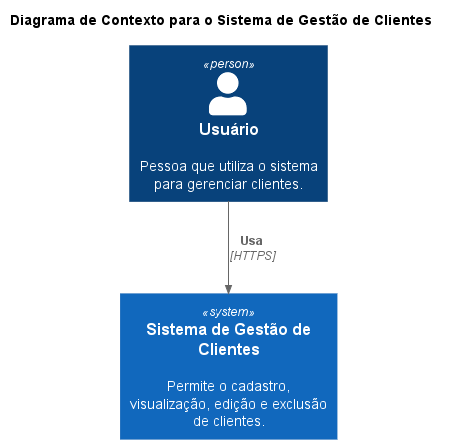
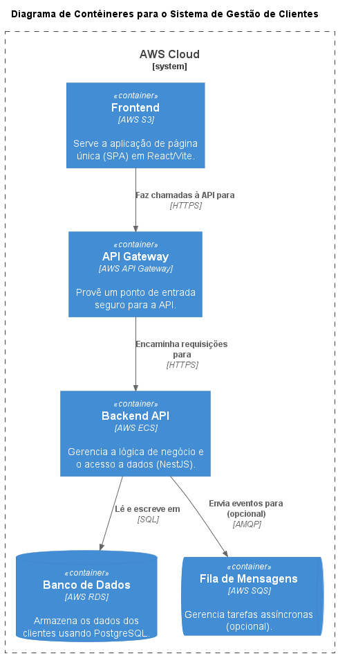

# Fullstack CRUD de Clientes – Teste Técnico

## Visão Geral
Aplicação fullstack para cadastro e gestão de clientes, pronta para produção em AWS, com arquitetura modular, documentação, testes e observabilidade.

---

## 🏗️ Estrutura do Projeto

- **backend/** – API NestJS (TypeORM, Postgres, Swagger, validação, logger, testes, mensageria opcional)
- **frontend/** – React + Vite (TypeScript, Tailwind, componentes reutilizáveis, integração REST, testes E2E opcional)
- **docker-compose.yml** – Orquestração local (backend, frontend, Postgres)
- **diagrams/** – Diagramas C4 (PlantUML)

### Arquitetura Visual (Diagramas C4)

**Nível 1: Contexto do Sistema**


**Nível 2: Contêineres**


**Nível 3: Componentes do Backend**


---

## 🚀 Como rodar localmente

### Pré-requisitos
- Docker e Docker Compose instalados

### Passos rápidos
```sh
git clone <repo>
cd customers
docker-compose up --build
```
- Frontend: http://localhost:5173
- Backend (Swagger): http://localhost:3000/api
- Postgres: localhost:5432 (user: postgres, senha: postgres)

---

## 🐳 Como rodar manualmente (sem Docker)

### Backend
```sh
cd backend
npm install
npm run start:dev

# Rodar testes unitários
npm test
```

### Frontend
```sh
cd frontend
npm install
npm run dev

# Abrir interface do Cypress para testes E2E
npm run cypress:open
```

### Banco de dados
- Suba um Postgres local (porta 5432, banco: customers, user/senha: postgres)

---

## 📦 Decisões Arquiteturais
- **NestJS**: Modularidade, escalabilidade, integração fácil com TypeORM/Postgres, documentação Swagger nativa.
- **TypeORM**: ORM maduro, suporte a migrations, integração com NestJS.
- **React + Vite**: Build rápido, DX moderna, fácil integração com TypeScript e Tailwind.
- **Tailwind**: Produtividade e padronização visual.
- **Docker Compose**: Facilita onboarding e ambiente local idêntico ao de produção.
- **Mensageria (BullMQ/RabbitMQ)**: Pronto para escalar e desacoplar operações pesadas.
- **Observabilidade**: Logger customizado, interceptadores, integração futura com CloudWatch.
- **Testes**: Unitários (Jest no backend), E2E (Cypress no frontend).
- **AWS Ready**: Infra desenhada para RDS, ECS/EKS, S3, API Gateway, CloudWatch.

---

## ✨ Funcionalidades Adicionais e Melhorias

Além do CRUD básico, o projeto inclui melhorias focadas em qualidade de código, observabilidade e experiência de uso:

- **Testes Unitários (Backend)**: Foram implementados testes unitários com **Jest** para o `ClientsController` e `ClientsService`. Os testes utilizam mocks para isolar as dependências (como o repositório TypeORM), garantindo que a lógica de negócio e as rotas da API funcionem como esperado.
  - **Como rodar**: `cd backend && npm test`

- **Testes E2E (Frontend)**: Para garantir a estabilidade da interface e a integração com o backend, foi configurado o **Cypress** para testes End-to-End. O teste principal (`crud.cy.ts`) simula o fluxo completo de um usuário: criar, editar e excluir um cliente, validando cada etapa.
  - **Como rodar**: `cd frontend && npm run cypress:open`

- **Logger Customizado (Backend)**: Foi criado um `MyLogger` que estende o logger padrão do NestJS. Ele adiciona um prefixo `[CUSTOM]` às mensagens e pode ser facilmente estendido para enviar logs para serviços centralizados como AWS CloudWatch, melhorando a observabilidade em produção.

- **Tela de Visualização de Selecionados (Frontend)**: A interface agora permite que o usuário selecione múltiplos clientes através de checkboxes. Um botão "Visualizar Selecionados" leva o usuário a uma nova página (`/selected-customers`) que exibe apenas os itens escolhidos, facilitando a análise e gestão de um subconjunto de clientes.

---

## 📝 Respostas obrigatórias

1. **Quanto tempo levaria para desenvolver?**
   - Aproximadamente 3 a 5 dias úteis para entregar MVP funcional, incluindo testes e documentação.
2. **Quantos devs seriam necessários?**
   - 1 dev fullstack experiente consegue entregar o MVP. Para produção robusta, 2 devs (1 backend, 1 frontend) aceleram.
3. **Qual a senioridade dos devs?**
   - Pleno para MVP. Sênior recomendado para arquitetura, automação CI/CD e AWS.

---

## 📊 Diagramas C4

- **Contexto:** `diagrams/c4-context.puml`
- **Containers:** `diagrams/c4-container.puml`
- **Componentes (backend):** `diagrams/c4-components-backend.puml`
- **Exemplo código:** `diagrams/c4-code-examples.puml`

Visualize com [PlantUML](https://plantuml.com/pt/).

---

## 🎬 Roteiro para vídeo de apresentação
1. Apresentar README e estrutura de pastas.
2. Subir stack com Docker Compose.
3. Demonstrar cadastro/listagem/edição/exclusão de clientes.
4. Mostrar Swagger da API.
5. Mostrar diagramas C4.
6. Explicar decisões arquiteturais e diferenciais (testes, mensageria, observabilidade).

---

## 📚 Referências
- [NestJS Docs](https://docs.nestjs.com/)
- [React Docs](https://react.dev/)
- [PlantUML C4](https://github.com/plantuml-stdlib/C4-PlantUML)

---

> Dúvidas? Fique à vontade para perguntar!
